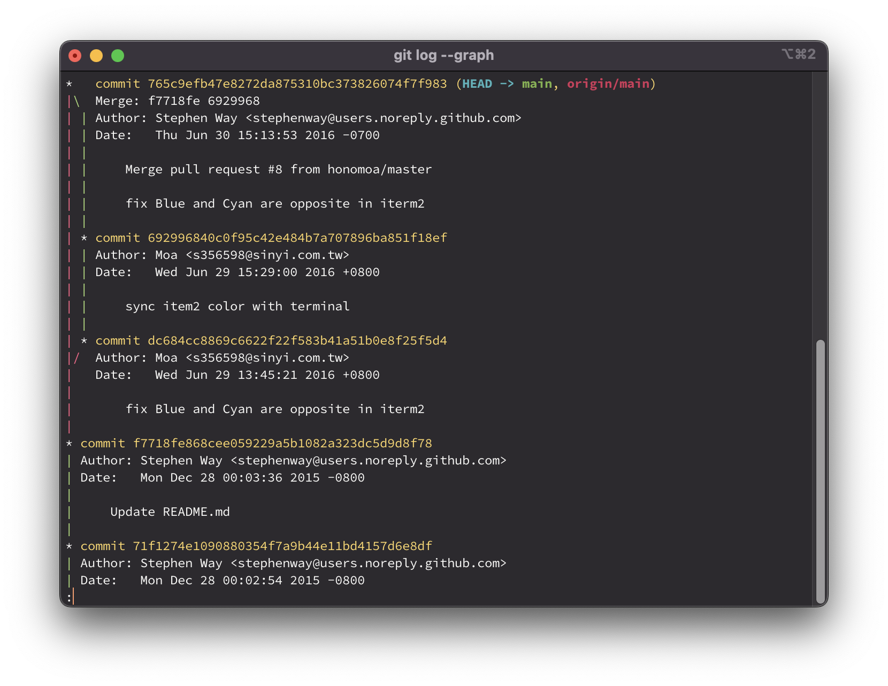
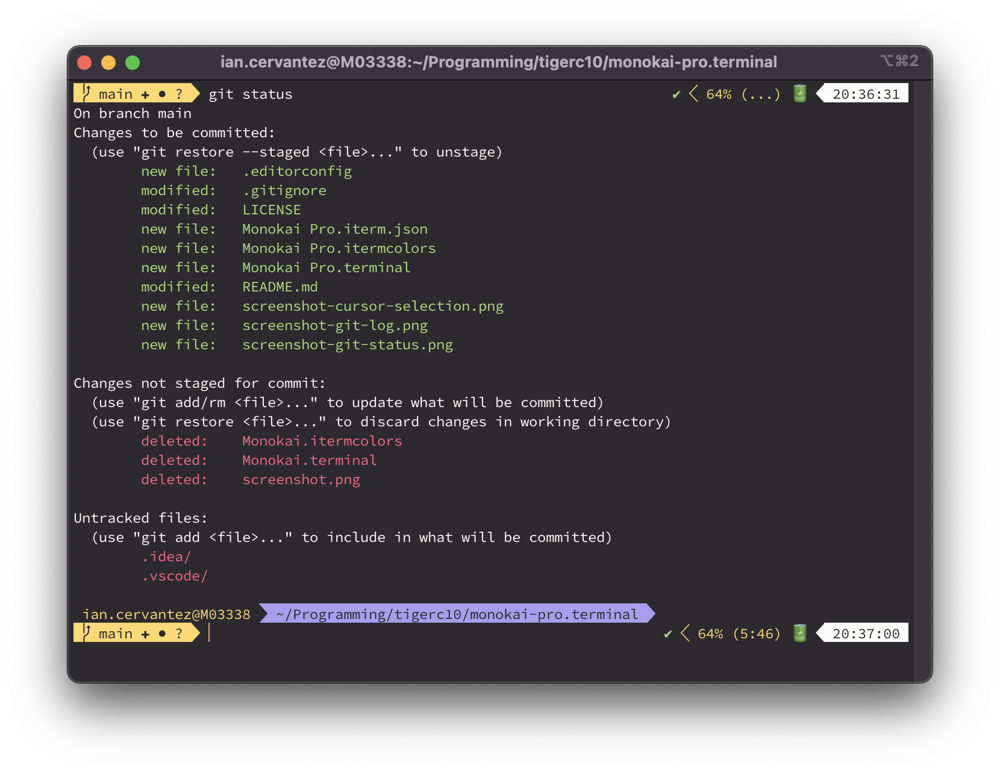
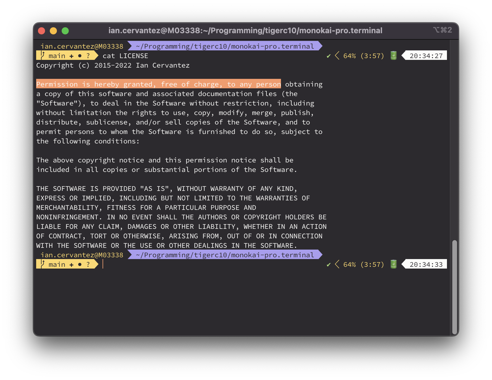

# Monokai Pro.terminal
🌈 A beautiful theme for MacOS Terminal and iTerm2

## Screenshots




## Installation

### MacOS Terminal
1. Open Terminal Preferences
2. Switch to the Profiles tab
3. At the bottom of the profiles list, click the "other actions" circle icon
4. Import the `Monokai Pro.terminal` file
5. Optionally, select Monokai Pro and click the "Default" button below

### iTerm2
1. Open iTerm2 Preferences
2. Switch to the Profiles tab
3. Under the "other actions" button, select "import JSON profiles..."
4. Import the `Monokai Pro.iterm.json` file
5. Optionally, under the "other actions" button select "Set as Default"

#### iTerm2 (Color Preset Only)
1. Open iTerm2 Preferences
2. Switch to the Profiles tab
3. Create a new profile, or select an existing profile (such as "★ Default")
4. Open the "Color Presets..." menu, then click "Import..."
5. Import the `Monokai Pro.itermcolors` file

### Hyper Terminal
Hyper Terminal doesn't support exportable/importable color schemes, but you can set the `.hyper.js` file configuration like so:

```javascript
module.exports = {
  config: {
    cursorColor: '#2D2A2E',
    cursorAccentColor: '#FCFCFA',
    foregroundColor: '#FDFDFA',
    backgroundColor: '#2D2A2E',
    selectionColor: '#FC9867',
    colors: {
      black: '#2D2A2E',
      red: '#FF6188',
      green: '#A9DC76',
      yellow: '#FFD866',
      blue: '#AB9DF2',
      magenta: '#FC9867',
      cyan: '#78DCE8',
      white: '#FCFCFA',
      lightBlack: '#000000',
      lightRed: '#D2375A',
      lightGreen: '#7CB248',
      lightYellow: '#D2AE38',
      lightBlue: '#7E73C4',
      lightMagenta: '#CF6E39',
      lightCyan: '#4BB2BA',
      lightWhite: '#FFFFFF',
    },
  }
}
```

### Alfred App
If you aren't using the excellent (award winning) productivity app Alfred on MacOS, what are you even doing with your life?

Download the [Monokai Pro Theme](https://www.alfredapp.com/extras/theme/jKb5wtiE3r/) from [alfredapp.com](https://www.alfredapp.com/),
or open the [Monokai Pro.alfredappearance](Monokai%20Pro.alfredappearance) file provided in this repository.

## Notes

### Font
The profiles in this project may come preconfigured with
[Adobe's Source Code Pro](https://github.com/adobe-fonts/source-code-pro/releases/latest).
It wasn't _exactly_ intentional to do that, just what the terminal export provided when exporting the profiles from
my personal configuration.  Feel free to change the font selection to any other terminal compatible font.

### Color Choices

#### Selection Color
I set the terminal selection color differently than what you might consider _purely_ Monokai Pro.  Magenta is a very
seldom used color in terminal applications, so I decided I wanted to see it as the selection color. If you want to
adjust the selection color to match the Monokai Pro theme a little better, set it to `#c1c0c0` or if your terminal
supports alpha channels then either `rgba(193, 192, 192, 0.15)` or `#c1c0c026` would work.

#### Cursor Color
Normally the cursor color would be `#fcfcfa` and the cursor text would be `#2d2a2e`, however it turns out that not
all terminals support cursor text colors (I'm looking at you, Apple) meaning that a box style cursor of the same color
as the default foreground color would cause characters to disappear.  I've opted to use the same color as the selection
color (`#fc9867`) to overcome this.  As stated before, if you know you have a `|` or `_` cursor rather than box style
then you are free to switch back to the same color as the foreground.

### Shell Prompt
The screenshots show off this color profile in use with Z Shell (specifically, [Oh My Zsh](https://ohmyz.sh))
and the [Powerlevel10k theme](https://github.com/romkatv/powerlevel10k).

## License
This project is licensed under the MIT [license](LICENSE).

## Credits
* The [Monokai](http://monokai.nl) color scheme was created by [Wimer Hazenberg](https://github.com/Monokai)
  * Please go purchase [Monokai Pro](https://monokai.pro) for your IDE if you enjoy it
* This project is forked from [https://github.com/stephenway/monokai.terminal](https://github.com/stephenway/monokai.terminal) by [Stephen Way](https://github.com/stephenway)
